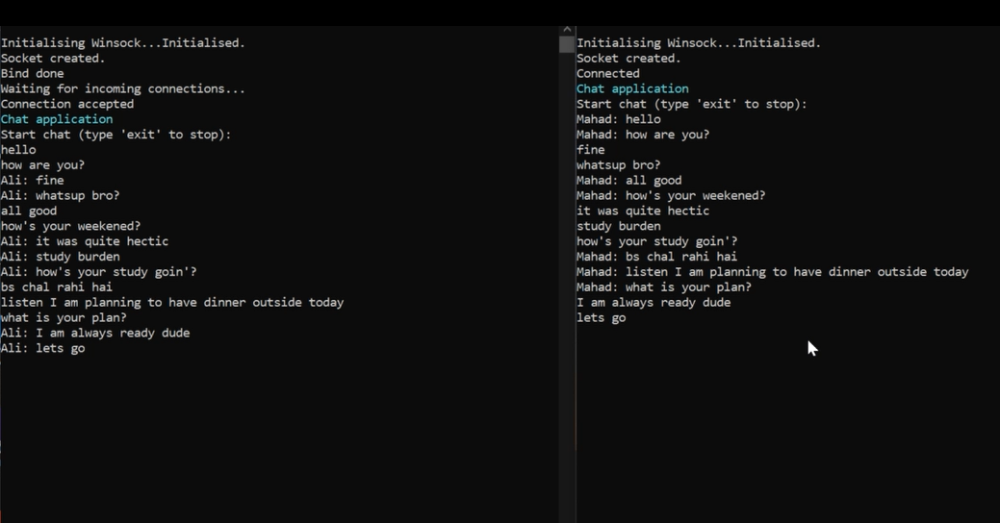
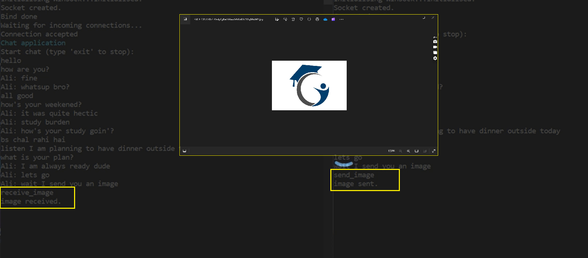

# ByteChat - Windows Socket Chat Application

ByteChat is a simple chat application implemented in C for the Windows environment. It allows users to exchange text messages and even share images in real-time using sockets.

## Features

- **Text Messaging**: Users can send and receive text messages in real-time.
- **Image Sharing**: ByteChat supports the exchange of images between users.
- **User-Friendly Interface**: The console-based interface makes it easy to use and navigate.

## Prerequisites

Before running ByteChat, ensure that you have the following installed:

- Windows OS
- [CMake](https://cmake.org/download/) (for building the project)
- Visual Studio (or any other C compiler compatible with Windows)

## How to Use

1. **Building the Project:**

   - Open a terminal and navigate to the project directory.
   - Run the following commands:
     ```bash
     mkdir build
     cd build
     cmake ..
     make
     ```

2. **Running the Server:**

   - Execute the `server.exe` binary generated in the build directory.
   - The server will start listening for incoming connections.

3. **Running the Client:**

   - Execute the `client.exe` binary generated in the build directory.
   - Enter the server's IP address when prompted.
   - Start chatting by sending text messages or use commands like `send_image` or `receive_image` to share images.

4. **Exiting the Application:**
   - Type `exit` to stop the chat application.

## Important Notes

- ByteChat supports the exchange of images using the `send_image` and `receive_image` commands.
- Ensure that the server is running before connecting clients.
- File paths for image sharing are currently hard-coded in the code. Modify them based on your system's directory structure.

## Contribution

Contributions are welcome! If you'd like to contribute to ByteChat, please follow these steps:

1. Fork the repository.
2. Create a new branch for your feature (`git checkout -b feature/your-feature`).
3. Commit your changes (`git commit -m 'Add some feature'`).
4. Push to the branch (`git push origin feature/your-feature`).
5. Open a pull request.

## Demonstration Images




